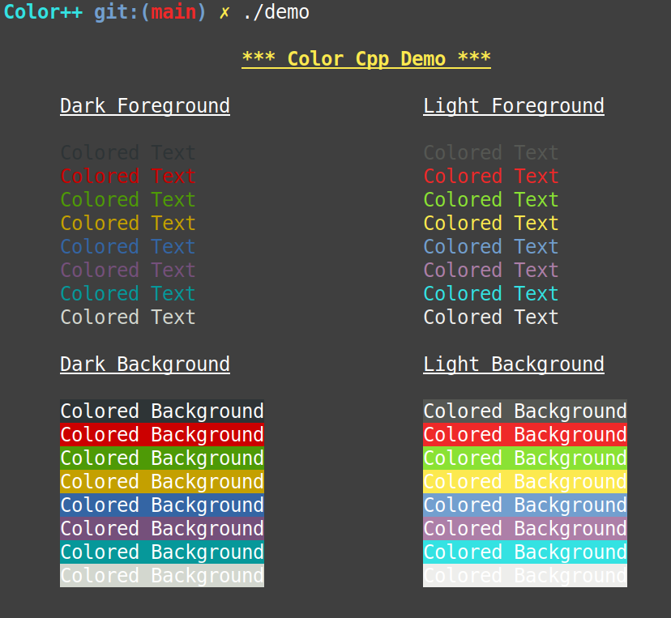

# ColorCpp
A simple C++ library for writing colorful texts.



## Usage
To make a text colored, pass the text to `color::Colored()` and specify the color:
```cpp
std::cout << color::Colored("This is a colored text!", color::RED) << std::endl;
```
The available colors are:
```cpp
color::RED    
color::GREEN  
color::YELLOW 
color::BLUE   
color::MAGENTA
color::CYAN   
color::GRAY   
```
In order to apply a Foreground/Background color to the text, add a `Foreground`/`Background` scope resolution to the color:
```cpp
std::cout << color::Colored("Foreground color", color::Foreground::BLUE) << std::endl;
std::cout << color::Colored("Background color", color::Background::YELLOW) << std::endl;
```
You can make text **Bold** with `color::BOLD` or **Underlined** with `color::UNDERLINE`.

Up to 3 arguments can be passed to `color::Colored()` indicating **Foreground color**, **Background color**, and **Bold/Underline** formats:
- 1 argument:
  ```cpp
  std::cout << color::Colored("Foreground color", color::Foreground::BLUE) << std::endl;
  std::cout << color::Colored("Background color", color::Background::YELLOW) << std::endl;
  ```
- 2 arguments:
  ```cpp
  std::cout << color::Colored("Two arguments", color::Foreground::BLUE, color::Background::YELLOW) << std::endl;
  std::cout << color::Colored("Two arguments", color::Foreground::WHITE, color::BOLD) << std::endl;
  ```
- 3 argumetns:
  ```cpp
  std::cout << color::Colored("Three arguments", color::Foreground::GREEN, color::Background::YELLOW, color::UNDERLINE) << std::endl;
  ```
  
